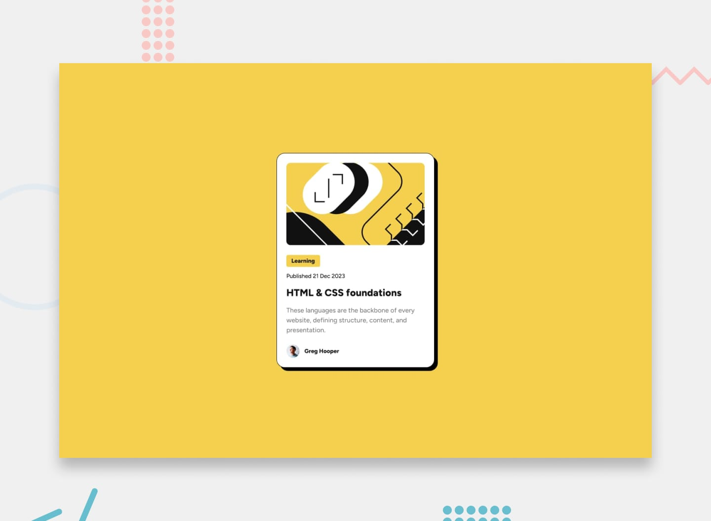
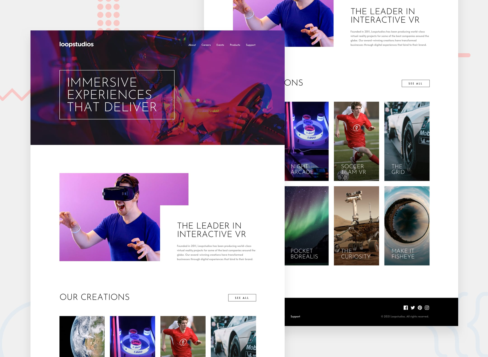
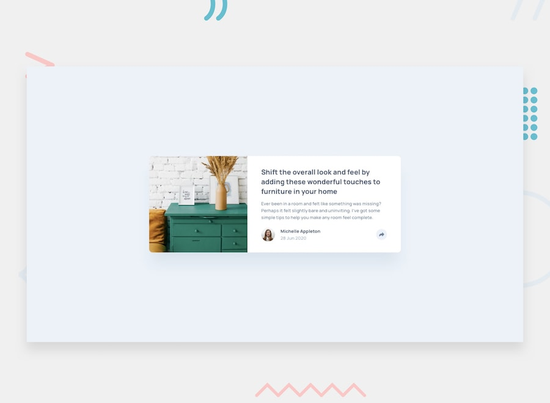
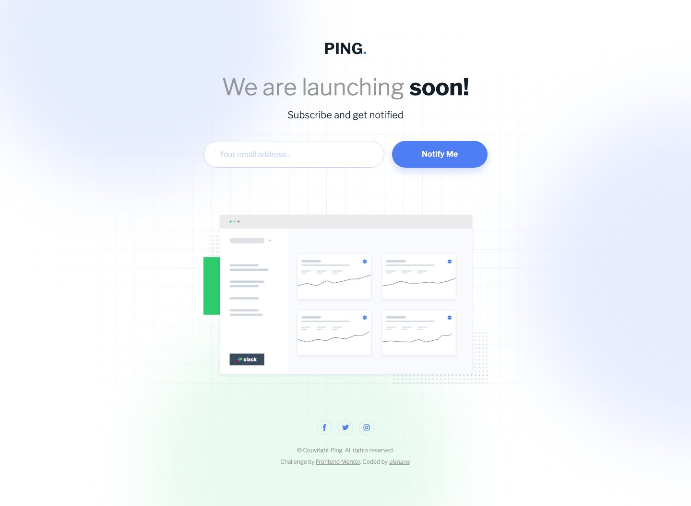
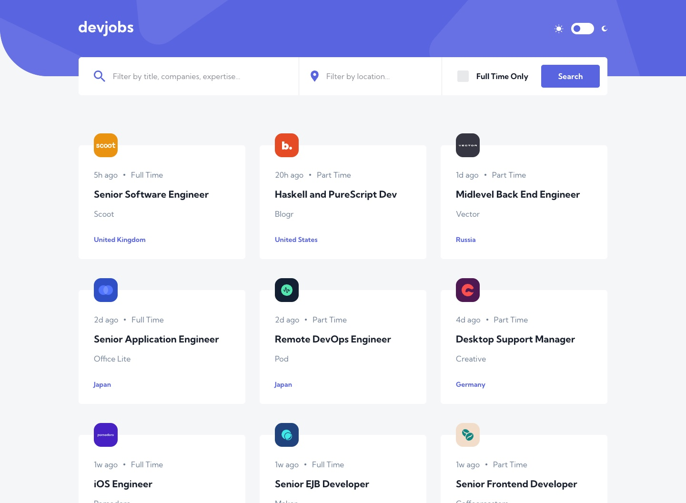
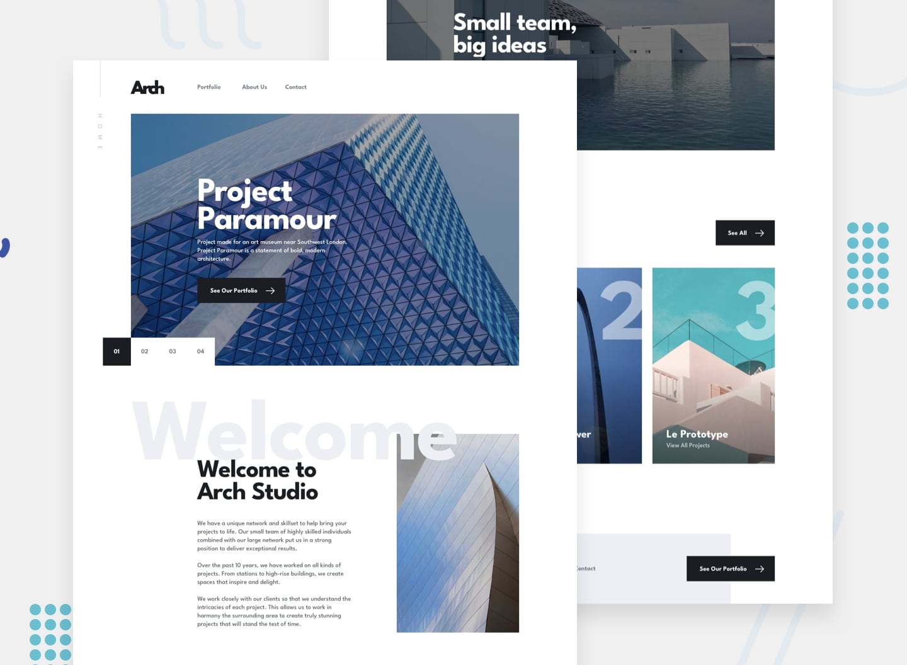
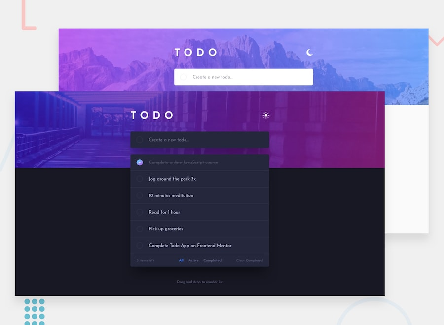
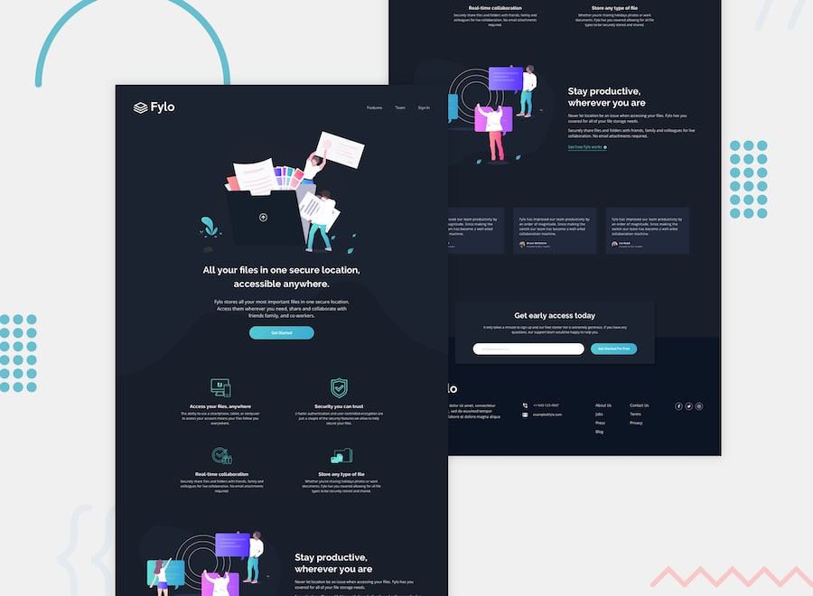

# fem

My solutions to [Frontend Mentor](https://www.frontendmentor.io) challenges, all in one repo. Each folder is a standalone project with its own dependencies and README.

## Projects

| Project                                                             | Stack                                                         | Preview                                                                                                                |
| ------------------------------------------------------------------- | ------------------------------------------------------------- | ---------------------------------------------------------------------------------------------------------------------- |
| [QR code component](./qr-code)                                      | HTML, CSS                                                     |                            |
| [Product preview card](./product-preview-card)                      | HTML, Tailwind CSS                                            |            |
| [Results summary](./results-summary)                                | HTML, Tailwind CSS, JS                                        |                      |
| [Social proof section](./social-proof-section)                      | HTML, Tailwind CSS                                            |            |
| [Blog preview card](./blog-preview-card)                            | HTML, Tailwind CSS                                            |                                 |
| [Skilled e-learning landing page](./skilled-elearning-landing-page) | HTML, Tailwind CSS                                            |      |
| [News homepage](./news-homepage)                                    | HTML, Tailwind CSS, JS                                        |                                         |
| [Loopstudios landing page](./loopstudios)                           | HTML, Tailwind CSS, JS                                        |                                |
| [Article preview component](./article-preview-component)            | HTML, CSS, JS                                                 |  |
| [Base Apparel coming soon page](./base-apparel-coming-soon)         | HTML, CSS, JS                                                 |              |
| [Ping coming soon page](./ping-coming-soon)                         | HTML, Tailwind CSS, JS                                        |                              |
| [IP address tracker](./ip-address-tracker)                          | HTML, Tailwind CSS, JS, Netlify Functions                     |                |
| [URL shortening API](./url-shortening-api)                          | Next.js, TypeScript, Tailwind CSS, Route Handlers             |                               |
| [Devjobs web app](./devjobs)                                        | Next.js, TypeScript, Tailwind CSS, Postgres + Prisma          |                                             |
| [Invoice app](./invoice-app)                                        | Next.js, TypeScript, Tailwind CSS, Postgres + Prisma          |                                             |
| [Arch Studio multi-page website](./arch-studio)                     | Astro, Tailwind CSS, TypeScript, Leaflet                      |                          |
| [Todo app](./todo-app)                                              | Next.js, TypeScript, Tailwind CSS, Postgres + Prisma, dnd-kit |                                                   |
| [Fylo dark theme landing page](./fylo)                              | HTML, Tailwind CSS, JS                                        |                                   |

## Running a project

Everything runs from inside the project folder:

```bash
cd <project>
npm install
```

- **Static Tailwind projects:** run `npm run dev:tw` to watch-build the CSS into `dist/`, then open `index.html`.
- **IP address tracker:** run `npm run dev` (starts `netlify dev`).
- **Devjobs, URL shortening API, invoice app:** run `npm run dev`. Devjobs and the invoice app need Postgres; see their READMEs.
- **Fylo:** uses pnpm (`pnpm install`, `pnpm dev:tw`), then open `index.html`.
- **Todo app:** uses pnpm (`pnpm install`, `pnpm dev`) and needs Postgres; see its README.
- **Arch Studio:** run `npm run dev` (Astro dev server).
- **QR code, Article preview, Base Apparel:** plain HTML/CSS/JS, so just open `index.html`.

## Author

- GitHub: [@elshanx](https://github.com/elshanx)
- Frontend Mentor: [@fem](https://www.frontendmentor.io/profile/elshanx)
