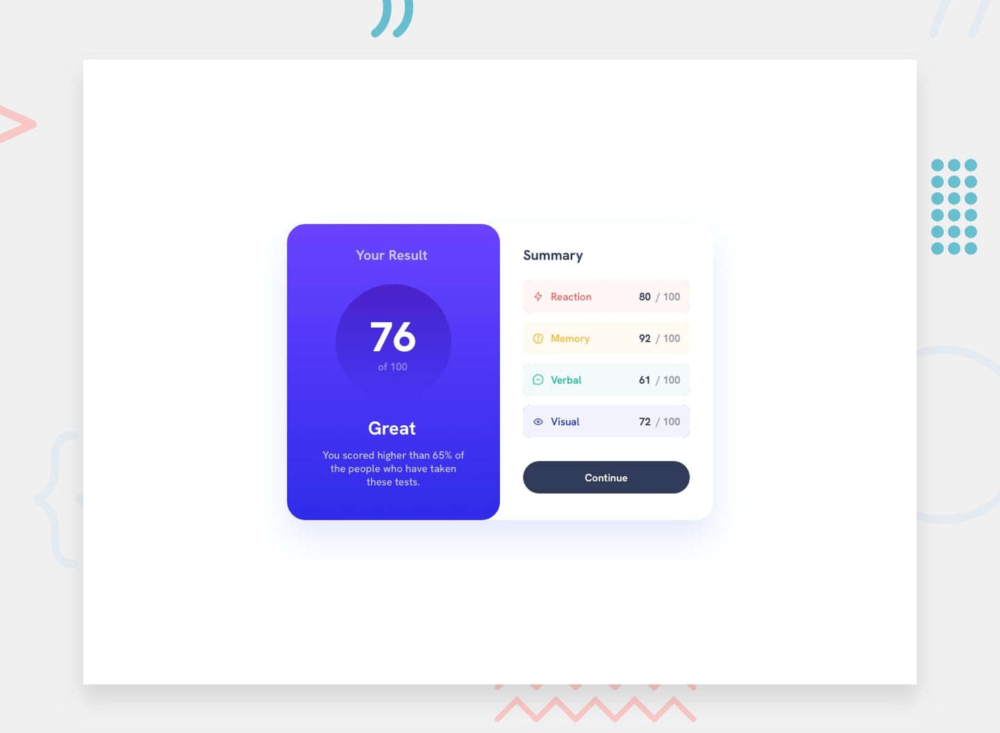
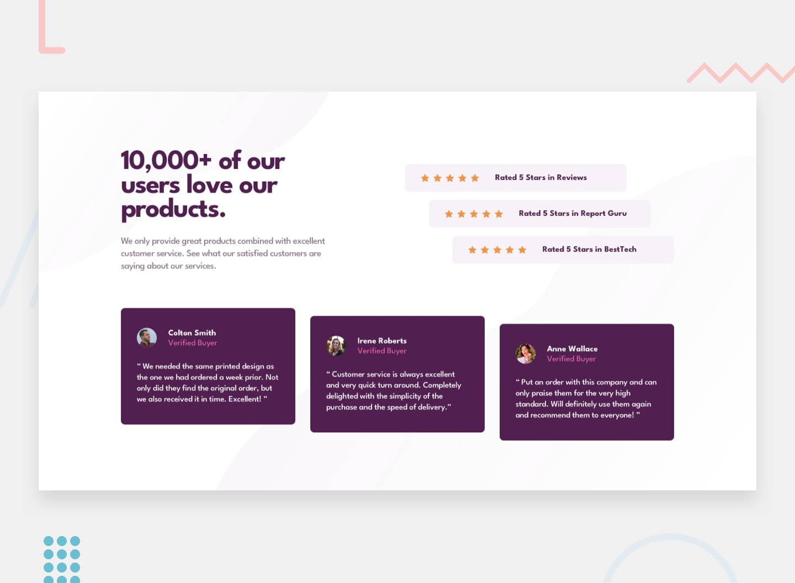
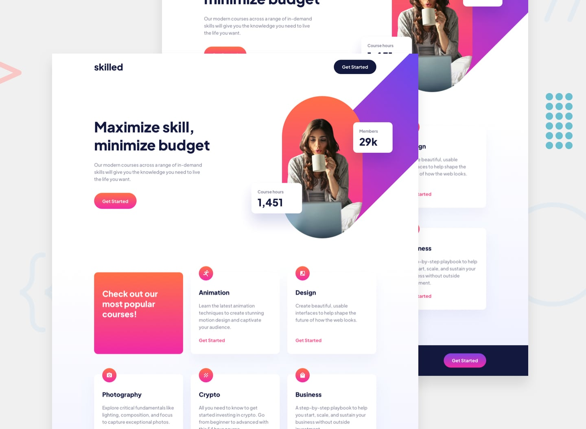
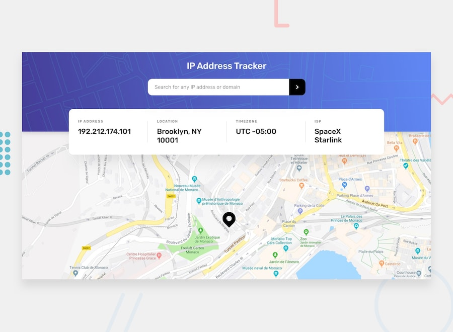
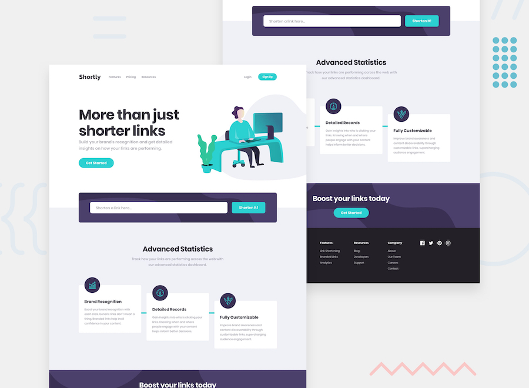

# fem

My solutions to [Frontend Mentor](https://www.frontendmentor.io) challenges, all in one repo. Each folder is a standalone project with its own dependencies and README.

## Projects

| Project                                                             | Stack                                                   | Preview                                                                                                            |
| ------------------------------------------------------------------- | ------------------------------------------------------- | ------------------------------------------------------------------------------------------------------------------ |
| [QR code component](./qr-code)                                      | HTML, CSS                                               |                        |
| [Product preview card](./product-preview-card)                      | HTML, Tailwind CSS                                      |        |
| [Results summary](./results-summary)                                | HTML, Tailwind CSS, JS                                  |                  |
| [Social proof section](./social-proof-section)                      | HTML, Tailwind CSS                                      |        |
| [Skilled e-learning landing page](./skilled-elearning-landing-page) | HTML, Tailwind CSS                                      |  |
| [IP address tracker](./ip-address-tracker)                          | HTML, Tailwind CSS, JS, Netlify Functions               |            |
| [URL shortening API](./url-shortening-api)                         | Next.js, TypeScript, Tailwind CSS, Route Handlers       |                           |
| [Devjobs web app](./devjobs)                                        | Next.js, TypeScript, Tailwind CSS, daisyUI              |                                                                                                                    |
| [Invoice app](./invoice-app)                                        | React + Vite + TypeScript client, Express + MongoDB API |                                                                                                                    |

The invoice app has three parts: `client` (current Vite rewrite), `old-client` (original CRA + Redux + styled-components version) and `server` (REST API).

## Running a project

Everything runs from inside the project folder:

```bash
cd <project>
npm install
```

- **Static Tailwind projects:** run `npm run dev:tw` to watch-build the CSS into `dist/`, then open `index.html`.
- **IP address tracker:** run `npm run dev` (starts `netlify dev`).
- **Devjobs, URL shortening API, invoice-app/client:** run `npm run dev`.
- **invoice-app/server:** run `npm run dev`. It needs a `.env` with `MONGO_DB_URI` (and optionally `PORT`, which defaults to 5000).
- **QR code:** plain HTML/CSS, so just open `index.html`.

## Author

- GitHub: [@elshanx](https://github.com/elshanx)
- Frontend Mentor: [@fem](https://www.frontendmentor.io/profile/elshanx)
