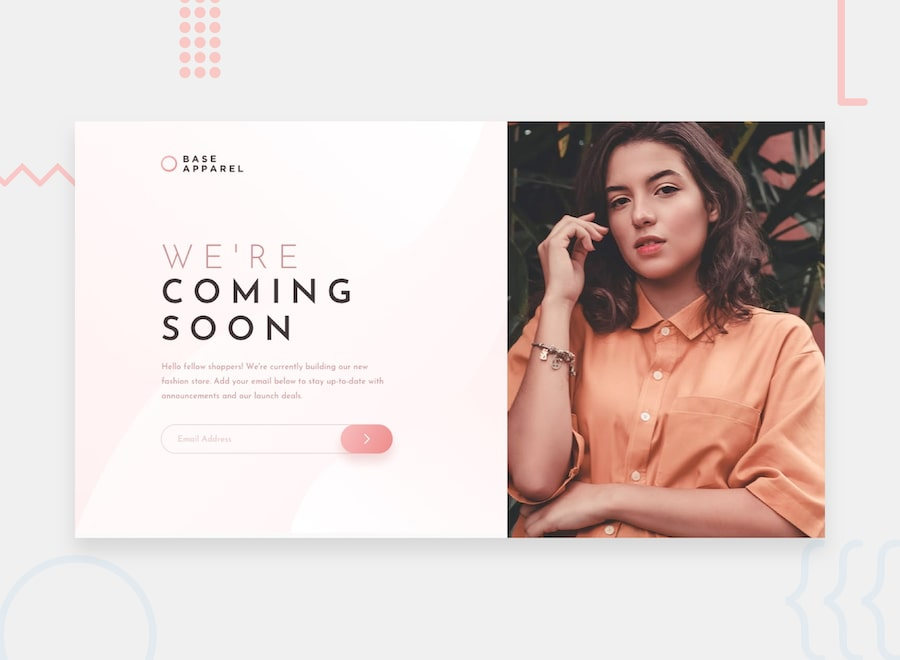

# Frontend Mentor - Base Apparel coming soon page

Solution to the [Base Apparel coming soon page](https://www.frontendmentor.io/challenges/base-apparel-coming-soon-page-5d46b47f8db8a7063f9331a0) challenge.

## Features

- Responsive from 320px up: stacked mobile layout, two-column desktop layout from 1024px
- Hero image swaps between the mobile and desktop crops with `<picture>`
- Email validation on submit: separate messages for an empty field and a badly formatted address, announced to screen readers through `aria-live`, with the field marked `aria-invalid`
- Hover and focus states on the input and submit button
- Josefin Sans from Google Fonts

## Stack

HTML, CSS, vanilla JS. No build step.

## Running

Open `index.html`.

## Author

- GitHub: [@elshanx](https://github.com/elshanx)
- Frontend Mentor: [@elshanx](https://www.frontendmentor.io/profile/elshanx)
