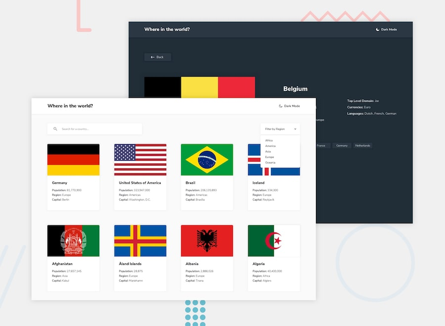

# Frontend Mentor - REST Countries API with color theme switcher

Solution to the [REST Countries API with color theme switcher](https://www.frontendmentor.io/challenges/rest-countries-api-with-color-theme-switcher-5cacc469fec04111f7b848ca) challenge on [Frontend Mentor](https://www.frontendmentor.io).



## Features

- All 250 countries on the homepage, built from the bundled `data.json`
- Search ranks matches: name prefix first (`ger` → Germany), then word prefix, then substring
- Custom region dropdown following the WAI-ARIA select-only combobox pattern (arrow keys, Home/End, type-ahead, Escape, click outside)
- Search and region live in the URL (`?q=&region=`), so Back from a detail page restores them and filtered views are shareable
- Detail page per country with clickable border countries and a not-found state for unknown codes
- Light/dark theme that follows the system preference, persists in `localStorage`, and is applied before first paint (no flash)
- Back-to-top button that respects `prefers-reduced-motion`
- Responsive from 320px up

## Stack

React 19, Vite, TypeScript, Tailwind CSS v4, React Router, ESLint (airbnb-extended), Prettier.

## Running

```bash
pnpm install
pnpm dev          # http://localhost:5173
```

`pnpm build` type-checks and writes the site to `dist/`, `pnpm test` runs the search tests, `pnpm lint` runs ESLint, and `pnpm format` runs Prettier.

The app imports a slimmed copy of the data (`src/data/countries.json`, only the fields the UI uses). Run `pnpm data` to regenerate it after editing `data.json`.

## Author

- GitHub: [@elshanx](https://github.com/elshanx)
- Frontend Mentor: [@elshanx](https://www.frontendmentor.io/profile/elshanx)
