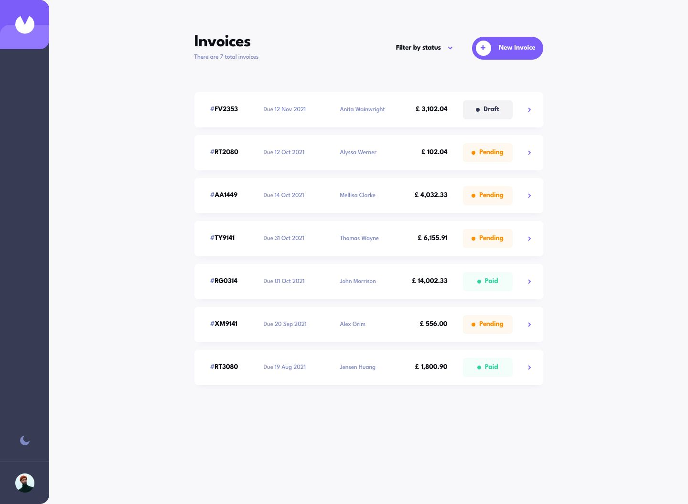

# Frontend Mentor - Invoice app

Solution to the [Invoice app](https://www.frontendmentor.io/challenges/invoice-app-i7KaLTQjl) challenge.



## Features

- Invoice list with a status filter (draft, pending, paid) that lives in the URL, so a filtered view can be shared
- Invoice detail page with Edit, Delete (behind a confirm dialog) and Mark as Paid
- One slide-out form for creating and editing, with an editable item list, live totals and per-field errors
- "Save as Draft" skips validation; saving changes to a draft validates it and moves it to Pending
- Payment due date worked out from the invoice date and payment terms (Net 1/7/14/30 days)
- Light/dark theme that follows the system and remembers your choice
- Responsive at desktop, tablet and mobile; on mobile the invoice actions move to a sticky footer

## Stack

Next.js 16 (App Router, server components, server actions), TypeScript, Tailwind CSS v4, Postgres + Prisma 7, next-themes, zod. Linted with the Airbnb style guide (`eslint-config-airbnb-extended`) and formatted with Prettier.

## How it's built

- `prisma/schema.prisma` defines `Invoice` and `InvoiceItem`. Money is stored as integer cents, and totals are computed when read rather than stored. `prisma/seed.ts` loads the challenge data from `prisma/data.json`.
- `src/lib/invoice.ts` holds the rules: form parsing, the zod validation, draft defaults, money and date helpers, and id generation. These are unit-tested in `invoice.test.ts`.
- `src/lib/invoices.ts` runs the queries, and `src/app/actions.ts` has the server actions for saving, marking as paid and deleting.
- Pages query the database directly from server components; there is no separate API.

## Running

Needs a running Postgres.

```bash
cp .env.example .env   # then set DATABASE_URL
npm install            # also generates the Prisma client
npm run db:migrate
npm run db:seed
npm run dev
```

`npm test` runs the unit tests, `npm run test:e2e` the browser tests, `npm run lint` the Airbnb rules, `npm run typecheck` the types, and `npm run format` Prettier.

The browser tests (Playwright, in `e2e/`) need their own database, because every run wipes and re-seeds it:

```bash
createdb invoice_app_test   # then set E2E_DATABASE_URL in .env
npx playwright install chromium
npm run test:e2e
```

## Author

- GitHub: [@elshanx](https://github.com/elshanx)
- Frontend Mentor: [@elshanx](https://www.frontendmentor.io/profile/elshanx)
