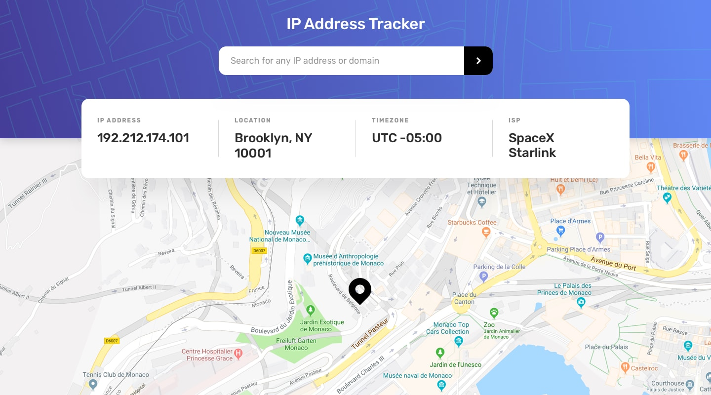

# Frontend Mentor - IP address tracker solution


This is a solution to the [IP address tracker challenge on Frontend Mentor](https://www.frontendmentor.io/challenges/ip-address-tracker-I8-0yYAH0). Frontend Mentor challenges help you improve your coding skills by building realistic projects.

## Table of contents

- [Overview](#overview)
  - [The challenge](#the-challenge)
  - [Screenshot](#screenshot)
  - [Links](#links)
- [My process](#my-process)
  - [Built with](#built-with)
  - [How it works](#how-it-works)
  - [What I learned](#what-i-learned)
  - [Continued development](#continued-development)
  - [Running it locally](#running-it-locally)
  - [Useful resources](#useful-resources)
- [Author](#author)

## Overview

### The challenge

Users should be able to:

- View the optimal layout for each page depending on their device's screen size
- See hover states for all interactive elements on the page
- See their own IP address on the map on the initial page load
- Search for any IP addresses or domains and see the key information and location

### Screenshot



### Links

- Solution URL: [GitHub](https://github.com/elshanx/fem/tree/main/ip-address-tracker)
- Live Site URL: [fem-ip-address-tracker-x.netlify.app](https://fem-ip-address-tracker-x.netlify.app/)

## My process

### Built with

- Semantic HTML5 markup
- Mobile-first workflow
- [Tailwind CSS](https://tailwindcss.com/) - utility-first styling
- Vanilla JavaScript (no framework or bundler)
- [Leaflet](https://leafletjs.com/) + OpenStreetMap tiles - for the map
- [IP Geolocation API by IPify](https://geo.ipify.org/) - for IP and domain lookups
- [Netlify Functions](https://docs.netlify.com/functions/overview/) - to keep the API key off the client

### How it works

The app is a single static page (`index.html`) plus one small script (`app.js`). There is no framework and no build step for the JavaScript; the only build step is compiling Tailwind into `dist/output.css`.

**Keeping the API key secret.** IPify doesn't let you restrict a key to a domain, so calling it straight from the browser would expose the key to anyone who opens dev tools. Instead, the browser calls my own endpoint, `/api/ip-lookup`, which is a Netlify Function. The function reads `IPIFY_API_KEY` from an environment variable, forwards the request to IPify and returns the response unchanged. A redirect in `netlify.toml` maps `/api/*` to `/.netlify/functions/*`, so the front end uses a clean URL.

```js
// netlify/functions/ip-lookup.js
const url = new URL('https://geo.ipify.org/api/v2/country,city');
url.searchParams.set('apiKey', process.env.IPIFY_API_KEY);
if (ipAddress) {
  url.searchParams.set('ipAddress', ipAddress);
}
```

**Showing the visitor's own IP on load.** When the page loads, `app.js` calls the endpoint with no query. IPify then looks up the IP the request came from, so the user sees their own location straight away.

**Searching.** Submitting the form sends the value as the `ipAddress` parameter, which IPify accepts for both IPs and domains. While a request is in flight, the submit button is disabled. If the lookup fails, or the input is empty, an error message appears under the search bar. It uses `role="alert"`, so screen readers announce it.

**The map.** The Leaflet map is created once, on the first successful lookup. Later searches just move the view and the custom marker with `setView` and `setLatLng`, instead of tearing down and rebuilding the map.

**Layout.** The info card is absolutely positioned so it overlaps the header and the map, as in the design. On mobile the four fields stack with horizontal dividers; from the `md` breakpoint they sit in a row with vertical dividers (`divide-y` swaps to `md:divide-x`). The design's colours, the Rubik font and both background patterns are added to the Tailwind theme, so they work like any other utility class (`text-very-dark-gray`, `bg-pattern-desktop`, ...).

### What I learned

- Using a serverless function as a thin proxy is an easy way to keep an API key out of client-side code, even on an otherwise static site.
- Netlify redirects with `status = 200` act as rewrites, so the function can live behind a friendly `/api/...` path.
- Leaflet's default marker can be swapped for any SVG with `L.icon`. Setting `iconAnchor` to the bottom centre of the icon makes the pin point at the exact location.
- `min-h-dvh` (dynamic viewport height) avoids the classic mobile bug where `100vh` is taller than the visible screen because of the browser's address bar.

### Continued development

- Validate IP addresses and domains on the client before sending a request.
- Show a loading indicator on the map and card, not only a disabled button.
- Handle lookups with missing fields more gracefully (for example, a result with no city).

### Running it locally

1. Sign up for a free IPify account and copy your API key.
2. Copy `.env.example` to `.env` and set `IPIFY_API_KEY`.
3. Install dependencies and start the dev servers:

```bash
npm install
npm run dev:tw   # Tailwind in watch mode
npm run dev      # netlify dev: serves the site and the function
```

On Netlify, set `IPIFY_API_KEY` in the site's environment variables. The build command (`npm run build:css`) is already configured in `netlify.toml`.

### Useful resources

- [Leaflet quick start guide](https://leafletjs.com/examples/quick-start/) - map setup and markers.
- [Netlify Functions docs](https://docs.netlify.com/functions/overview/) - writing and deploying serverless functions.
- [IPify Geolocation API docs](https://geo.ipify.org/docs) - request parameters and response format.

## Author

- GitHub - [@elshanx](https://github.com/elshanx)
- Frontend Mentor - [@elshanx](https://www.frontendmentor.io/profile/elshanx)
