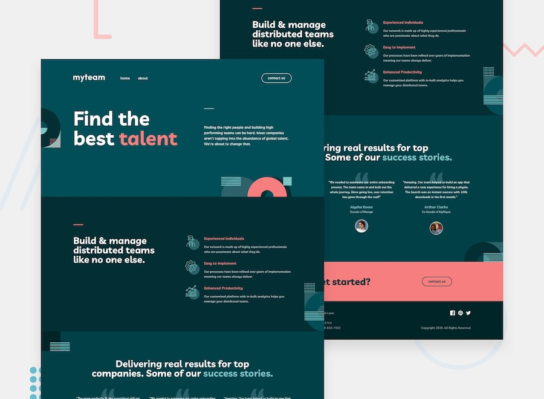

# Frontend Mentor - myteam multi-page website

Solution to the myteam multi-page website challenge on [Frontend Mentor](https://www.frontendmentor.io).



## Features

- Three pages (home, about, contact) with mobile, tablet (768px+) and desktop (1024px+) layouts
- Mobile slide-in menu with overlay that closes on Escape or a click outside
- Director cards on the About page: the `+` button flips each card to that person's quote and social links (`aria-expanded` kept in sync)
- Hover states for nav links, buttons, card toggles, social icons and form fields
- Contact form validation: "This field is required" for an empty name, email or message, "Please use a valid email address" for a bad email; errors are tied to fields with `aria-describedby` and `aria-invalid`

## Stack

Astro, Tailwind CSS v4, TypeScript, Prettier.

## Running

```bash
pnpm install
pnpm dev          # http://localhost:4321
```

`pnpm build` writes the static site to `dist/`, `pnpm check` type-checks, and `pnpm format` runs Prettier.

## Author

- GitHub: [@elshanx](https://github.com/elshanx)
- Frontend Mentor: [@elshanx](https://www.frontendmentor.io/profile/elshanx)
